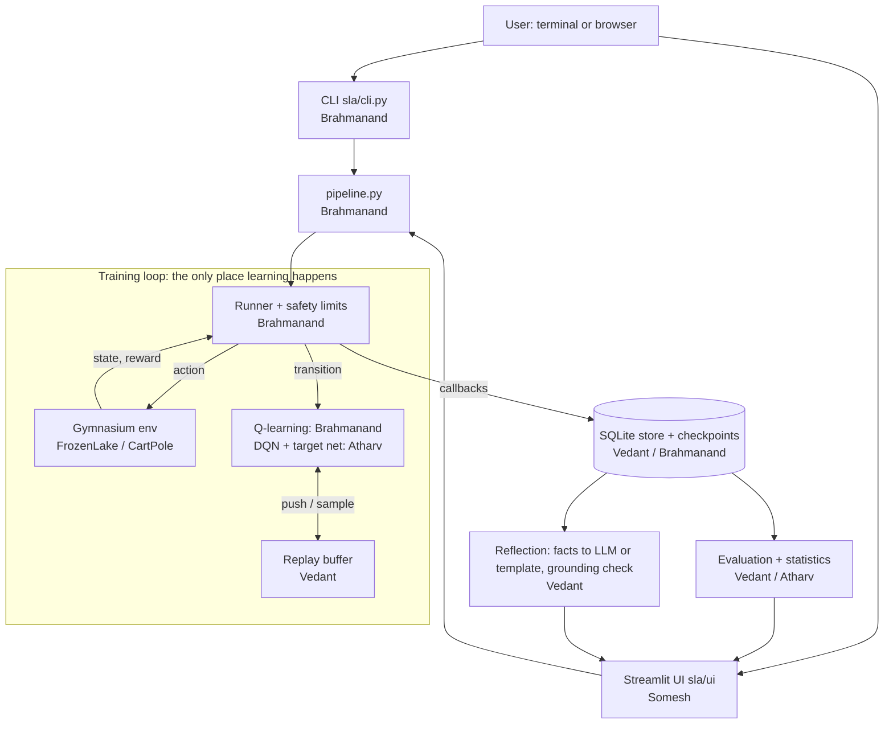
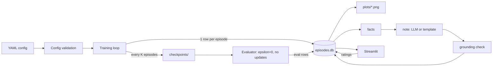
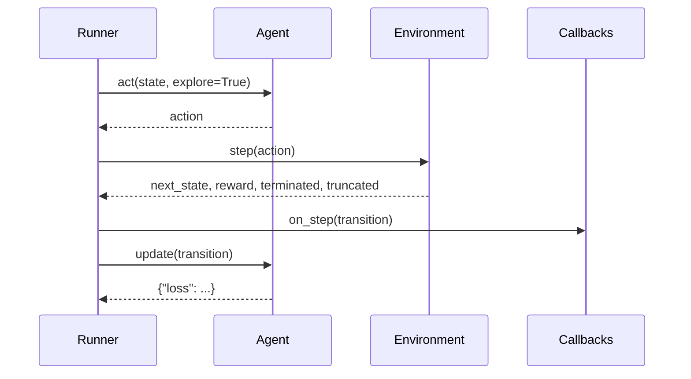

# WEEK 02 — Research and System Architecture

**Project:** Self-Learning AI Agent · **Team:** Brahmanand Mathpati, Atharv Gundale, Vedant Biradar, Somesh Badwane
**Source:** *Self_Learning_AI_Agent_10_Week_Master_Plan* (v1.0) · **Budget:** ₹0 software

---

## SECTION 1 — WEEK OVERVIEW

| Item | Details |
|---|---|
| Week number | 2 of 10 |
| Week title | Research and System Architecture |
| Main objective | Learn the RL theory we need, choose the smallest Python stack, and **freeze the architecture and module interfaces** so four people can code in parallel from Week 3. |
| Expected outcome | `docs/design.md` with frozen interfaces; architecture and data-flow diagrams (Mermaid); tech-stack table with licences; literature review of 8–10 genuine sources; a measured local-LLM decision; synopsis draft; Somesh's first tested Python module. |
| Required knowledge | Week-1 RL vocabulary (agent, state, action, reward, policy). This week adds: Markov decision process, Q-values, Bellman update, exploration vs exploitation, DQN, experience replay, target network. |
| Required tools | Week-1 tools + `pip install pytest` (Somesh) + optional Ollama (Atharv's benchmark). |
| Prerequisites from previous weeks | Merged `docs/requirements.md`, `docs/nfr.md`, `docs/hardware_audit.md`; everyone can open a PR. |
| Approximate workload | 11 h per member. |
| Technical dependencies | Interface meeting (Day 2) before anyone writes the design sections; hardware audit (Week 1) before the LLM benchmark. |
| Definition of Done | `docs/design.md` merged and **signed off by all four** (interfaces frozen); `docs/architecture.md` + `docs/tech_stack.md` merged; LLM decision recorded with numbers; `docs/literature_review.md` merged; synopsis draft sections exist; `tests/unit/test_io_helpers.py` passes. |

**In simple words:** this week we agree on the *shape* of every piece of code before writing it — like agreeing the size of every Lego brick before four people build different parts of one model.

---

## SECTION 2 — WHAT WE ARE BUILDING THIS WEEK

1. **What:** the design — module boundaries, function signatures ("interface contracts"), data flow, storage schema, evaluation rules, tech stack — plus Somesh's `src/sla/utils/io_helpers.py`.
2. **Why:** in Weeks 3–7 four people code at the same time. If Brahmanand's runner calls `agent.update(batch)` but Atharv's DQN expects `agent.update(transition)`, nothing integrates. Frozen interfaces prevent this.
3. **Connection to the agent:** `docs/design.md` is the contract every later week implements. The weekly files of Weeks 3–10 use exactly these names.
4. **If missing:** duplicate work, mismatched function names, a DQN that cannot plug into the runner, and a week lost in integration.
5. **Final output:** a design document that answers, for every module: *who owns it, what it is called, what goes in, what comes out, what errors it raises.*

**Analogy:** an electrical socket standard. Once everyone agrees on the plug shape, any appliance (random agent, Q-learning, DQN) plugs into the same socket (the runner).

### RL theory for this week (everyone reads; Atharv explains on Day 1)
- **Markov decision process (MDP):** states S, actions A, rewards R, transitions. The next state depends only on the current state and action.
- **Return:** total future reward, discounted: `G = r₁ + γ·r₂ + γ²·r₃ + …` with discount γ (0.99 means future reward still matters a lot).
- **Q-value Q(s, a):** expected return if you take action *a* in state *s* and act well afterwards.
- **Bellman / Q-learning update:** `Q(s,a) ← Q(s,a) + α[r + γ·maxₐ′ Q(s′,a′) − Q(s,a)]` (Watkins & Dayan, 1992). Terminal step: no `γ·max` term.
- **Exploration vs exploitation (ε-greedy):** with probability ε take a random action (explore), otherwise the best known action (exploit). ε starts at 1.0 and decays to 0.05.
- **Why DQN for CartPole:** CartPole's state is 4 continuous numbers — a table cannot list every state, so a small neural network estimates Q-values (Mnih et al., 2015).
- **Experience replay:** store transitions; train on random mini-batches so consecutive, correlated steps do not dominate learning (Lin, 1992).
- **Target network:** a copy of the network, refreshed every C steps, used to compute stable targets.
- **Terminated vs truncated (Gymnasium):** *terminated* = the task really ended (pole fell, fell in a hole) → no future value. *truncated* = time limit reached → the next state still has value, so the target must bootstrap.

---

## SECTION 3 — DAILY EXECUTION PLAN

### Day 1 — RL study session and Python environment (1.5 h)
- **Daily objective:** shared RL understanding; Somesh has a working virtual environment.
- **Assigned members:** all (45-min session led by Atharv), then individual reading.
- **Individual tasks:** Atharv presents Section 2 theory using the Week-1 worked example; Brahmanand reads Sutton & Barto ch. 6.5 (Q-learning); Vedant reads Lin (1992) §3–4 and Mnih et al. (2015) Methods; Somesh does SLA-02-SB-1 steps 1–3 (venv + lists/tuples/sets).
- **Required commands (Somesh):**
  ```bash
  cd self-learning-ai-agent
  python -m venv .venv
  # Windows PowerShell: .venv\Scripts\Activate.ps1      Mac/Linux: source .venv/bin/activate
  python -m pip install --upgrade pip
  pip install pytest
  ```
- **Expected files:** none committed (`.venv/` is git-ignored).
- **Expected output:** prompt shows `(.venv)`; `pytest --version` prints a version.
- **Testing steps:** everyone answers "what is the TD error?" in one sentence in the chat.
- **GitHub activity:** Atharv creates Week-2 issues #21–#28 (Section 7).
- **Completion checklist:** - [ ] session done · - [ ] Somesh's venv works

### Day 2 — Interface meeting (1.5 h, sync 60 min)
- **Daily objective:** agree every interface in Section 5.1 line by line.
- **Assigned members:** all; Brahmanand chairs, Atharv decides ties.
- **Individual tasks:** walk through Section 5.1; each owner confirms their module's signatures; record changes.
- **Expected files:** draft `docs/design.md` on branch `docs/brahmanand-21-design` (Brahmanand types, others comment).
- **Expected output:** list of agreed signatures; open questions listed at the bottom.
- **Testing steps:** "paper trace" — Brahmanand reads one FrozenLake episode aloud through the interfaces (reset → act → step → Transition → callbacks → update → EpisodeInfo); anyone spots a mismatch.
- **GitHub activity:** draft PR opened.
- **Completion checklist:** - [ ] trace completed without mismatch

### Day 3 — Drafts (1.5 h)
- **Daily objective:** each owner drafts their design section.
- **Assigned members:** Brahmanand (agent/runner/CLI), Atharv (architecture diagrams, DQN choices), Vedant (memory schema, evaluation rules, literature table), Somesh (`io_helpers.py`).
- **Individual tasks:** SLA-02-BM-1 steps 3–5 · SLA-02-AG-1 steps 1–3 · SLA-02-VB-2 steps 1–2 · SLA-02-SB-1 steps 4–6.
- **Expected files:** sections inside `docs/design.md`, `docs/architecture.md`, `src/sla/utils/io_helpers.py`.
- **Testing steps:** Vedant creates the SQL tables in a throw-away database (Section 5.4 commands); Somesh runs his first tests.
- **GitHub activity:** pushes to feature branches.
- **Completion checklist:** - [ ] drafts pushed

### Day 4 — Benchmark and schema check (1.5 h)
- **Daily objective:** measured LLM decision; schema verified.
- **Assigned members:** Atharv (benchmark on the weakest laptop), Vedant (schema), Brahmanand (synopsis), Somesh (tests).
- **Individual tasks:** SLA-02-AG-2 steps 1–5 · SLA-02-VB-2 steps 3–4 · SLA-02-BM-2 steps 1–2 · SLA-02-SB-1 steps 7–9.
- **Required commands (Atharv, on the weakest laptop):**
  ```bash
  ollama pull qwen2.5:1.5b
  pip install requests psutil
  python spikes/llm_benchmark.py --model qwen2.5:1.5b --runs 3
  ```
- **Expected output:** seconds per note and Ollama memory, recorded in `docs/tech_stack.md`.
- **Completion checklist:** - [ ] LLM decision written with numbers

### Day 5 — Literature review and synopsis (1.5 h)
- **Daily objective:** literature table and synopsis sections drafted.
- **Assigned members:** Vedant (literature), Brahmanand (synopsis Introduction, Problem, Existing, Proposed), Atharv (reviews), Somesh (PR).
- **Individual tasks:** SLA-02-VB-1 · SLA-02-BM-2 steps 3–4 · Somesh opens PR.
- **Expected files:** `docs/literature_review.md`, `docs/synopsis_draft.md`.
- **Completion checklist:** - [ ] ≥ 8 sources with full citation and link

### Day 6 — Freeze (2.5 h)
- **Daily objective:** all Week-2 documents merged; interfaces frozen.
- **Assigned members:** all.
- **Individual tasks:** resolve review comments; each member writes "Approved — <name>" at the bottom of `docs/design.md`; Atharv tags `w2-design-freeze`.
- **Required commands (Atharv after merge):**
  ```bash
  git checkout main && git pull
  git tag -a w2-design-freeze -m "Interfaces frozen"
  git push origin w2-design-freeze
  ```
- **Completion checklist:** - [ ] four approvals in design.md · - [ ] tag pushed

### Day 7 — Weekly review (1 h)
- **Daily objective:** demo and plan Week 3. Brahmanand runs the agenda (Section 12).
- **Completion checklist:** - [ ] Section 13 complete

---

## SECTION 4 — INDIVIDUAL MEMBER TASKS

### Brahmanand Mathpati

**Task ID:** SLA-02-BM-1
**Task Title:** Agent, runner and CLI interface design
**Priority:** P1
**Estimated Duration:** 6 h (study 3, writing 2, meeting 1)
**Dependencies:** Week-1 requirements
**Assigned Member:** Brahmanand Mathpati

1. **What:** sections 5.1-A to 5.1-D of `docs/design.md`: `Transition`, `Agent`, `Callback`, `run_training`, `EpisodeInfo`, `RunResult`, seeding policy, CLI commands.
2. **Why:** you implement these in Weeks 3–5; everyone else plugs into them.
3. **File:** `docs/design.md` (you own the document; Vedant and Atharv add their sections through your branch or a follow-up PR).
4. **Function/class:** design only — `Agent.act/update/end_episode/epsilon/save/load`, `run_training(cfg, callbacks, agent, run_dir, run_id, start_episode)`.
5. **Inputs:** Section 5.1 of this file; Gymnasium API (`reset` → `(obs, info)`, `step` → `(obs, reward, terminated, truncated, info)`).
6. **Outputs:** frozen signatures in Markdown.
7. **Steps:**
   1. Read Section 5.1 fully.
   2. Chair the Day-2 meeting; type agreed changes.
   3. Write the "paper trace" of one episode (Section 5.1-E) into the document.
   4. Add the CLI command table (5.1-D) — commands arrive in Weeks 5–7.
   5. Add the ownership table (5.1-H).
8. **Commands:** `git checkout -b docs/brahmanand-21-design` → edit → `git add docs/design.md` → `git commit -m "docs(design): add frozen interfaces for agent and runner"` → push → PR.
9. **Tests:** paper trace with the team; every REQ-01…REQ-21 maps to a module in the ownership table.
10. **Expected result:** a design that four members approve without open questions.
11. **Common errors:** designing for features not in the MVP; forgetting the `truncated` flag in `Transition`.
12. **Branch:** `docs/brahmanand-21-design`
13. **Commit:** `docs(design): add frozen interfaces for agent and runner`
14. **PR title:** `docs: system design and frozen interfaces (SLA-02-BM-1)`
15. **Acceptance:** four approvals; tag `w2-design-freeze`; reviewer: Atharv.

**Task ID:** SLA-02-BM-2
**Task Title:** Synopsis draft — Introduction, Problem Statement, Existing and Proposed System
**Priority:** P2
**Estimated Duration:** 5 h (writing 3, research 1, review 1)
**Dependencies:** `docs/synopsis_outline.md` (Week 1)
**Assigned Member:** Brahmanand Mathpati

1. **What:** four synopsis sections in `docs/synopsis_draft.md` (copied into the college template in Week 9).
2. **Why:** the synopsis is usually reviewed early by the guide.
3. **File:** `docs/synopsis_draft.md`.
4. **Function/class:** none.
5. **Inputs:** the formal synopsis file (`Self_Learning_AI_Agent_Project_Synopsis.docx`) as a reference.
6. **Outputs:** ~2 pages of text, citations as (Author, Year).
7. **Steps:** 1) copy the four headings; 2) write each in your own words; 3) cite only sources from Vedant's literature table; 4) send to the guide for early feedback.
8. **Commands:** branch `docs/brahmanand-22-synopsis-draft`, add, commit, push, PR.
9. **Tests:** Vedant checks every citation exists in `docs/literature_review.md`.
10. **Expected result:** sections approved by the team.
11. **Common errors:** claiming results ("our agent achieves…") — write "the project aims to…".
12. **Branch:** `docs/brahmanand-22-synopsis-draft`
13. **Commit:** `docs(synopsis): draft introduction, problem, existing and proposed system`
14. **PR title:** `docs: synopsis draft sections 1-4 (SLA-02-BM-2)`
15. **Acceptance:** no unsupported claims; citations valid; reviewer: Vedant.

### Atharv Gundale

**Task ID:** SLA-02-AG-1
**Task Title:** Architecture diagrams and technology-stack freeze
**Priority:** P1
**Estimated Duration:** 5 h (research 2, diagrams 2, review 1)
**Dependencies:** Week-1 feasibility note
**Assigned Member:** Atharv Gundale

1. **What:** `docs/architecture.md` (Mermaid architecture, data-flow and training-loop diagrams) and `docs/tech_stack.md` (frozen stack with versions, licences, reasons).
2. **Why:** diagrams are needed for the synopsis, report and viva; a frozen stack stops people installing random libraries.
3. **Files:** `docs/architecture.md`, `docs/tech_stack.md`.
4. **Function/class:** none.
5. **Inputs:** Section 5.2 diagrams; master plan §5 stack.
6. **Outputs:** diagrams render on GitHub (GitHub renders Mermaid in Markdown automatically).
7. **Steps:** 1) paste the three Mermaid blocks from Section 5.2; 2) check they render in the PR preview; 3) write `docs/tech_stack.md` from Section 5.3; 4) mark "frozen on <date>".
8. **Commands:** branch `docs/atharv-23-architecture`, add, commit, push, PR.
9. **Tests:** GitHub preview renders all diagrams; every library in the stack is used by at least one module in `docs/design.md`.
10. **Expected result:** diagrams match the module list in `docs/design.md` exactly.
11. **Common errors:** Mermaid syntax error (one missing quote breaks the whole diagram) — preview at mermaid.live before committing.
12. **Branch:** `docs/atharv-23-architecture`
13. **Commit:** `docs(architecture): add mermaid diagrams and frozen tech stack`
14. **PR title:** `docs: architecture and tech stack (SLA-02-AG-1)`
15. **Acceptance:** every tool has licence + reason; diagrams match design.md; reviewer: Vedant.

**Task ID:** SLA-02-AG-2
**Task Title:** DQN design choices and local-LLM benchmark
**Priority:** P1
**Estimated Duration:** 6 h (research 1, coding 2, testing 1, mentoring/review 2)
**Dependencies:** `docs/hardware_audit.md` (weakest laptop)
**Assigned Member:** Atharv Gundale

1. **What:** section 5.1-F of `docs/design.md` (network size, loss, target sync, hyper-parameters, ablation flags) and `spikes/llm_benchmark.py` with its measured result.
2. **Why:** DQN choices must be fixed before Somesh writes the config validator (Week 3); the benchmark decides whether the optional LLM is feasible.
3. **Files:** `docs/design.md` (DQN section), `spikes/llm_benchmark.py`, results in `docs/tech_stack.md`.
4. **Function/class:** script functions `ollama_memory_mb()`, `main()`.
5. **Inputs:** Ollama installed on the weakest laptop; model `qwen2.5:1.5b` (Apache-2.0, ≈1 GB).
6. **Outputs:** median seconds per note, tokens/s, Ollama RAM.
7. **Steps:** 1) install Ollama; 2) `ollama pull qwen2.5:1.5b`; 3) run the script (Section 5.6) 3 times; 4) decide: < 60 s per note → LLM optional feature stays; otherwise try `qwen2.5:0.5b`; otherwise template only; 5) write the decision + numbers in `docs/tech_stack.md`. Mentoring: 1 h with Somesh on pytest (his Day 4).
8. **Commands:** see Day 4; branch `spike/atharv-24-llm-benchmark`.
9. **Tests:** benchmark run 3 times; numbers recorded with the laptop spec.
10. **Expected result:** a one-paragraph decision backed by measured numbers.
11. **Common errors:** `ConnectionRefusedError` → Ollama not running (start the Ollama app or `ollama serve`); first run slow because the model loads — report the median, not the first run.
12. **Branch:** `spike/atharv-24-llm-benchmark`
13. **Commit:** `spike(llm): benchmark qwen2.5:1.5b on weakest laptop`
14. **PR title:** `spike: local LLM benchmark and DQN design (SLA-02-AG-2)`
15. **Acceptance:** decision written with measured numbers; DQN section approved; reviewer: Brahmanand.

### Vedant Biradar

**Task ID:** SLA-02-VB-1
**Task Title:** Literature review (8–10 genuine sources)
**Priority:** P1
**Estimated Duration:** 5 h (research 3, writing 2)
**Dependencies:** none
**Assigned Member:** Vedant Biradar

1. **What:** `docs/literature_review.md` — a table: citation · contribution · use in our project · link.
2. **Why:** required in synopsis and report; prevents invented references.
3. **File:** `docs/literature_review.md`.
4. **Function/class:** none.
5. **Inputs:** the list in Section 5.5 (all are real, published works).
6. **Outputs:** table + 1-paragraph synthesis.
7. **Steps:** 1) open each source (arXiv, journal page or library); 2) write the contribution in your own words; 3) add the link/DOI; 4) write the synthesis paragraph.
8. **Commands:** branch `docs/vedant-25-literature`, add, commit, push, PR.
9. **Tests:** each link opens; each citation has authors, year, title, venue.
10. **Expected result:** ≥ 8 sources, all verified by opening them.
11. **Common errors:** citing a blog as research; inventing page numbers — leave out anything you could not verify.
12. **Branch:** `docs/vedant-25-literature`
13. **Commit:** `docs(literature): add verified literature review table`
14. **PR title:** `docs: literature review (SLA-02-VB-1)`
15. **Acceptance:** every source opened and verified; reviewer: Brahmanand.

**Task ID:** SLA-02-VB-2
**Task Title:** Memory schema, replay-buffer interface and evaluation rules
**Priority:** P1
**Estimated Duration:** 6 h (design 3, testing 1, writing 2)
**Dependencies:** Day-2 interface meeting
**Assigned Member:** Vedant Biradar

1. **What:** sections 5.1-G (memory and evaluation) of `docs/design.md`: SQLite schema, `ReplayBuffer` API, `EpisodeStore` API, evaluation rules (seeds, metrics).
2. **Why:** you build these in Weeks 4–6; reflection, plots and UI read this schema.
3. **File:** `docs/design.md` (your section).
4. **Function/class:** design of `ReplayBuffer`, `EpisodeStore`, `evaluate_agent`.
5. **Inputs:** Section 5.1-G and 5.4.
6. **Outputs:** schema SQL that runs without errors.
7. **Steps:** 1) copy the schema from Section 5.4; 2) run the check script (Section 5.4) to create the tables in a temporary database; 3) write the evaluation rules; 4) list metrics with formulas.
8. **Commands:**
   ```bash
   python -c "import sqlite3; con = sqlite3.connect(':memory:'); con.executescript(open('docs/schema_check.sql').read()); print([r[0] for r in con.execute(\"select name from sqlite_master where type='table'\")])"
   ```
   (Save the schema temporarily as `docs/schema_check.sql`; delete it after the check — the real schema lives in code from Week 5.)
9. **Tests:** prints `['runs', 'episodes', 'evals', 'reflections', 'feedback']` (sqlite_sequence may also appear).
10. **Expected result:** schema creates without errors; Brahmanand approves `EpisodeInfo` fields match the `episodes` columns.
11. **Common errors:** column names in `EpisodeInfo` and the table differ — they must be identical (`total_reward`, `length`, `epsilon`, `mean_loss`, `end_reason`, `wall_time_s`).
12. **Branch:** `docs/vedant-26-memory-schema`
13. **Commit:** `docs(design): add memory schema and evaluation rules`
14. **PR title:** `docs: memory schema and evaluation design (SLA-02-VB-2)`
15. **Acceptance:** schema creates; fields match `EpisodeInfo`; reviewer: Atharv.

### Somesh Badwane

**Task ID:** SLA-02-SB-1
**Task Title:** JSON and file helpers with your first unit tests
**Priority:** P2
**Estimated Duration:** 11 h (learning 4, coding 4, testing 1, review 1, docs 1)
**Dependencies:** Week-1 repository; Day-1 virtual environment
**Assigned Member:** Somesh Badwane

**0. Learn first (Section 5.7, ~4 h):** lists, tuples, sets; reading/writing files with `with open(...)`; JSON; exceptions (`try/except/raise`); modules and packages (`__init__.py`); virtual environments; what a unit test is and how pytest finds tests.

1. **What:** `src/sla/utils/io_helpers.py` with three functions — `ensure_dir`, `write_json`, `read_json` — and `tests/unit/test_io_helpers.py` with 5 tests.
2. **Why:** checkpoints (Week 5), metrics files (Week 6) and the run manifest (Week 8) all read/write JSON through your functions. One shared helper = one place to handle errors.
3. **Files:** create `src/sla/__init__.py`, `src/sla/utils/__init__.py` (both may be empty), `src/sla/utils/io_helpers.py`, `tests/unit/test_io_helpers.py`.
4. **Functions:** `ensure_dir(path) -> Path`, `write_json(path, data) -> Path`, `read_json(path) -> Any`.
5. **Inputs:** a file path (string or `Path`) and, for writing, any JSON-compatible data (dict, list, numbers, strings).
6. **Outputs:** a folder/file on disk; for `read_json`, the loaded Python data. Errors: `FileNotFoundError` (missing file), `ValueError` (invalid JSON, message includes the file name), `NotADirectoryError`.
7. **Step-by-step:**
   1. Activate your venv (Day 1).
   2. Do the Section 5.7 exercises.
   3. Create the folders `src/sla/utils/` and `tests/unit/`.
   4. Create the empty files `src/sla/__init__.py` and `src/sla/utils/__init__.py` (they tell Python "this folder is a package").
   5. Type `io_helpers.py` from Section 5.8 by hand; read the explanation.
   6. Type the tests from Section 5.8.
   7. Run the tests (command below). Until Week 3 the package is not installed, so we tell Python where `src` is with `PYTHONPATH`.
   8. Make one test fail on purpose (change `"Somesh"` to `"Atharv"` in the expected value), run pytest, read the red output, undo the change.
   9. Push and open the PR (same steps as Week 1).
8. **Commands:**
   ```bash
   git checkout main && git pull
   git checkout -b feat/somesh-27-io-helpers
   # Windows PowerShell:
   $env:PYTHONPATH = "src"; pytest tests/unit/test_io_helpers.py -v
   # Mac/Linux:
   PYTHONPATH=src pytest tests/unit/test_io_helpers.py -v
   git add src/sla/__init__.py src/sla/utils/__init__.py src/sla/utils/io_helpers.py tests/unit/test_io_helpers.py
   git commit -m "feat(utils): add JSON and folder helpers with tests"
   git push -u origin feat/somesh-27-io-helpers
   ```
9. **Tests:** the 5 tests in Section 5.8 (round trip, missing file, invalid JSON, nested folders, existing file).
10. **Expected result:**
    ```text
    tests/unit/test_io_helpers.py::test_write_then_read_roundtrip PASSED
    tests/unit/test_io_helpers.py::test_read_missing_file_raises PASSED
    tests/unit/test_io_helpers.py::test_read_invalid_json_raises_value_error PASSED
    tests/unit/test_io_helpers.py::test_ensure_dir_creates_nested_folders PASSED
    tests/unit/test_io_helpers.py::test_ensure_dir_rejects_existing_file PASSED
    ===== 5 passed in 0.05s =====
    ```
11. **Common errors:** `ModuleNotFoundError: No module named 'sla'` → you forgot `PYTHONPATH=src` or are not in the repo root folder; `pytest: command not found` → venv not active or pytest not installed.
12. **Branch:** `feat/somesh-27-io-helpers`
13. **Commit:** `feat(utils): add JSON and folder helpers with tests`
14. **PR title:** `feat: JSON and folder helpers (SLA-02-SB-1)`
15. **Acceptance:** 5 tests pass; PR follows the template; in review Somesh explains `try/except ... raise ... from exc`; reviewer: Atharv.

**Independent practice exercise:** add `append_line(path, text)` that appends one line to a text file (creating folders if needed) and write one test for it. Do not commit it — show it to Atharv in your 1-h session.

---

## SECTION 5 — COMPLETE TECHNICAL IMPLEMENTATION

### 5.1 `docs/design.md` — frozen interface contracts (all; Brahmanand edits)

Copy this into `docs/design.md`. These names are used **unchanged** in Weeks 3–10.

````markdown
# System design — Self-Learning AI Agent (frozen on <date>)

## A. Data passed between modules
```python
@dataclass
class Transition:          # sla/agent/base.py (Brahmanand, W3)
    state: Any
    action: int
    reward: float
    next_state: Any
    terminated: bool       # task really ended -> no future value
    truncated: bool        # time limit hit    -> still bootstrap

@dataclass
class EpisodeInfo:         # sla/agent/runner.py (Brahmanand, W4) — same names as the SQLite 'episodes' columns
    episode: int; total_reward: float; length: int; epsilon: float | None
    mean_loss: float | None; end_reason: str; wall_time_s: float

@dataclass
class RunResult:           # returned by run_training
    run_id: str; run_dir: Path; returns: list[float]; lengths: list[int]
    episodes_completed: int; stopped_reason: str   # "completed" | "wall_clock" | "callback"
```

## B. Agent interface (sla/agent/base.py, Brahmanand W3) — implemented by RandomAgent (W3), QLearningAgent (W4), DQNAgent (Atharv W4)
```python
class Agent(ABC):
    name: str
    def act(self, obs, explore: bool = True) -> int          # explore=False => greedy (evaluation)
    def update(self, transition: Transition) -> dict          # learn from ONE transition; may return {"loss": x}
    def end_episode(self) -> None                             # optional hook
    @property
    def epsilon(self) -> float | None
    def save(self, path: Path) -> None                        # writes a folder (meta.json + files)
    @classmethod
    def load(cls, path: Path) -> "Agent"
```
DQN keeps its replay buffer *inside* the agent: `update()` pushes the transition and trains every `train_freq` steps.

## C. Runner and plug-ins (sla/agent/runner.py, Brahmanand W4)
```python
def run_training(cfg: RunConfig, callbacks: list[Callback] | None = None, agent: Agent | None = None,
                 run_dir: Path | None = None, run_id: str | None = None, start_episode: int = 0) -> RunResult

class Callback:                                  # every later feature plugs in here; runner never changes after W4
    def on_run_start(self, ctx: RunContext) -> None
    def on_step(self, ctx: RunContext, transition: Transition) -> None
    def on_episode_end(self, ctx: RunContext, info: EpisodeInfo) -> bool   # True = stop training
    def on_run_end(self, ctx: RunContext, result: RunResult) -> None
```
Planned callbacks: StoreCallback (Vedant W5), CheckpointCallback (Brahmanand W5), PeriodicEvalCallback (Vedant W6),
TransitionValidationCallback (Somesh W6), DivergenceGuard + RegressionMonitor (Atharv W6).

## D. Command line (sla/cli.py, Brahmanand W5–W7)
| Command | Week |
|---|---|
| `sla train --config <yaml> [--seed N] [--episodes N]` | 5 (evaluates at the end from W6) |
| `sla resume --run runs/<run_id>` | 5 |
| `sla prune --older-than DAYS [--yes]` | 5 |
| `sla evaluate --checkpoint <folder>` | 6 |
| `sla pipeline --config <yaml> --seeds 0 1 2 3 4` · `sla reflect --run-id <id>` · `sla dashboard` | 7 |

## E. Paper trace of one episode
1. `env.reset(seed=episode_seed(cfg.seed, episode))` → `state`
2. loop: `action = agent.act(state, explore=True)` → `env.step(action)` → `(next_state, reward, terminated, truncated, info)`
3. build `Transition`; call every `callback.on_step`; `stats = agent.update(transition)`
4. episode ends → `agent.end_episode()` → `EpisodeInfo` → every `callback.on_episode_end` (any True → stop)

## F. Learning core decisions (Atharv)
- Q-learning (FrozenLake): α = 0.1, γ = 0.99, ε 1.0 → 0.05 over 10,000 steps, ties broken randomly.
- DQN (CartPole): MLP 4 → 128 → 128 → 2 (ReLU), Adam lr 5e-4, γ 0.99, Huber loss, gradient-norm clip 10,
  batch 64, buffer 50,000, learning starts after 1,000 steps, train every step, hard target sync every 500 steps,
  ε 1.0 → 0.05 over 10,000 steps. Ablation flags: `replay_enabled`, `target_net_enabled`.
- TD target: `y = r + γ·(1 − terminated)·max Q_target(s′)` — truncation still bootstraps.

## G. Memory and evaluation (Vedant)
- `ReplayBuffer(capacity, obs_dim, seed)`: `push(s, a, r, s2, terminated)`, `sample(batch) -> Batch`, `latest()`, `__len__`.
- `EpisodeStore(db_path)`: `start_run`, `log_episode(run_id, info)`, `log_eval`, `add_reflection`, `add_feedback`,
  `query_episodes(run_id) -> DataFrame`, `query_evals`, `list_runs`, `get_run`, `get_reflection`, `delete_run`.
- Seeds: training resets use `seed·100,000 + episode`; validation evaluation seeds start at 10,000,000 (choose best
  checkpoint); **test** seeds start at 20,000,000 (final numbers only, never used to choose anything).
- Evaluation: ε = 0, `update()` never called, 20 episodes during training, 100 for final numbers.
- Metrics: mean ± std return, success rate (FrozenLake goal; CartPole 500 steps), episodes to threshold, first-5% vs
  last-5%, Welch's t-test and bootstrap 95% CI across 5 seeds.

## H. Ownership
| Package / file | Owner | Week |
|---|---|---|
| utils/io_helpers, utils/config, utils/validation, utils/summary, evaluation/plots, ui/* | Somesh | 2–7, 10 |
| utils/seeding, envs/factory, agent/* , learning/q_learning, cli, pipeline | Brahmanand | 3–7 |
| learning/schedules, networks, dqn, guards, evaluation/stats, ablation, CI | Atharv | 3–8 |
| utils/errors, utils/logging_setup, memory/*, evaluation/evaluate, metrics, reflection/* | Vedant | 3–7 |

## I. Errors (sla/utils/errors.py, Vedant W3)
`SLAError` ← `ConfigError`, `ValidationError`, `EnvError`, `CheckpointError`, `StoreError`, `LLMError`, `TrainingError`.

Approved — Brahmanand ☐ · Atharv ☐ · Vedant ☐ · Somesh ☐
````

### 5.2 `docs/architecture.md` — Mermaid diagrams (Atharv)

````markdown
# Architecture

## 1. Components


## 2. Data flow


## 3. One training step

````

### 5.3 `docs/tech_stack.md` (Atharv)

```markdown
# Technology stack (frozen on <date>)
| Purpose | Choice | Version pin (W3) | Licence | Why |
|---|---|---|---|---|
| Language | Python | 3.10–3.12 | PSF | All code |
| Environments | gymnasium[classic-control] | >=1.0 | MIT | FrozenLake, CartPole, seeding |
| Arrays | numpy | >=1.26 | BSD-3 | Q-table, replay buffer |
| Neural network | torch (CPU) | latest CPU wheel | BSD-3 | DQN |
| Data | pandas | >=2.1 | BSD-3 | read store for plots/tables |
| Statistics | scipy | >=1.11 | BSD-3 | Welch t-test |
| Plots | matplotlib | >=3.8 | Matplotlib licence | curves |
| Config | pyyaml | >=6.0 | MIT | YAML configs |
| Storage | sqlite3 (stdlib) | — | Public domain | episode store |
| UI | streamlit | >=1.36 | Apache-2.0 | dashboard |
| HTTP | requests | >=2.31 | Apache-2.0 | Ollama client |
| System metrics | psutil | >=5.9 | BSD-3 | hardware, RAM |
| Tests / lint | pytest, pytest-cov, ruff | latest | MIT | quality |
| Optional LLM | Ollama + qwen2.5:1.5b | — | MIT / Apache-2.0 | explanation notes |

Not used (and why): FastAPI/Flask (UI calls Python directly), Transformers (Ollama uses less RAM),
scikit-learn (no classical ML task), vector databases (no retrieval), paid APIs.

## Local LLM benchmark (weakest laptop: <name, CPU, RAM>)
<paste output of spikes/llm_benchmark.py>
Decision: <LLM optional feature kept / use 0.5b / template only> because <numbers>.
```

### 5.4 SQLite schema check (Vedant)

Save as `docs/schema_check.sql` temporarily (the real schema is code in Week 5, `sla/memory/episode_store.py`):

```sql
CREATE TABLE runs (run_id TEXT PRIMARY KEY, env TEXT NOT NULL, agent TEXT NOT NULL, seed INTEGER NOT NULL,
                   config_json TEXT NOT NULL, git_sha TEXT, started_at TEXT NOT NULL);
CREATE TABLE episodes (run_id TEXT NOT NULL REFERENCES runs(run_id) ON DELETE CASCADE, episode INTEGER NOT NULL,
                       total_reward REAL NOT NULL, length INTEGER NOT NULL, epsilon REAL, mean_loss REAL,
                       end_reason TEXT, wall_time_s REAL, PRIMARY KEY (run_id, episode));
CREATE TABLE evals (run_id TEXT NOT NULL REFERENCES runs(run_id) ON DELETE CASCADE, checkpoint_episode INTEGER NOT NULL,
                    mean_return REAL NOT NULL, std_return REAL NOT NULL, success_rate REAL, n_episodes INTEGER NOT NULL,
                    created_at TEXT NOT NULL);
CREATE TABLE reflections (note_id INTEGER PRIMARY KEY AUTOINCREMENT, run_id TEXT NOT NULL REFERENCES runs(run_id)
                          ON DELETE CASCADE, facts_json TEXT NOT NULL, note_text TEXT NOT NULL, source TEXT NOT NULL,
                          grounding_passed INTEGER NOT NULL, grounding_report TEXT, created_at TEXT NOT NULL);
CREATE TABLE feedback (feedback_id INTEGER PRIMARY KEY AUTOINCREMENT, note_id INTEGER NOT NULL REFERENCES
                       reflections(note_id) ON DELETE CASCADE, accurate INTEGER NOT NULL, usefulness INTEGER NOT NULL,
                       comment TEXT, created_at TEXT NOT NULL);
```

### 5.5 Literature review sources (Vedant — all genuine; open each one before citing)

| # | Citation | Use in our project |
|---|---|---|
| 1 | Sutton, R. S., & Barto, A. G. (2018). *Reinforcement Learning: An Introduction* (2nd ed.). MIT Press. | Theory, notation |
| 2 | Watkins, C. J. C. H., & Dayan, P. (1992). Q-learning. *Machine Learning*, 8(3–4), 279–292. | Tabular agent |
| 3 | Lin, L.-J. (1992). Self-improving reactive agents based on reinforcement learning, planning and teaching. *Machine Learning*, 8(3–4), 293–321. | Experience replay |
| 4 | Barto, A. G., Sutton, R. S., & Anderson, C. W. (1983). Neuronlike adaptive elements that can solve difficult learning control problems. *IEEE Trans. Systems, Man, and Cybernetics*, SMC-13(5), 834–846. | Origin of cart-pole |
| 5 | Mnih, V., et al. (2015). Human-level control through deep reinforcement learning. *Nature*, 518(7540), 529–533. | DQN, target network |
| 6 | van Hasselt, H., Guez, A., & Silver, D. (2016). Deep reinforcement learning with double Q-learning. *AAAI*, 30(1). | Future work |
| 7 | Henderson, P., et al. (2018). Deep reinforcement learning that matters. *AAAI*, 32(1). | Why 5 seeds |
| 8 | Agarwal, R., et al. (2021). Deep reinforcement learning at the edge of the statistical precipice. *NeurIPS* 34. | Confidence intervals |
| 9 | Towers, M., et al. (2024). Gymnasium: A standard interface for reinforcement learning environments. arXiv:2407.17032. | Environments |
| 10 | Raffin, A., et al. (2021). Stable-Baselines3: Reliable reinforcement learning implementations. *JMLR*, 22(268), 1–8. | Reference implementations (existing system) |
| 11 | Shinn, N., et al. (2023). Reflexion: Language agents with verbal reinforcement learning. *NeurIPS* 36. arXiv:2303.11366. | Contrast: LLM "learning" via prompts |
| 12 | Ji, Z., et al. (2023). Survey of hallucination in natural language generation. *ACM Computing Surveys*, 55(12). | Why the grounding validator |

### 5.6 `spikes/llm_benchmark.py` (Atharv)

```python
"""Week-2 spike (owner: Atharv): can the weakest laptop run a small local LLM fast enough?

Prerequisites:  install Ollama (ollama.com/download), then:  ollama pull qwen2.5:1.5b
Run:            python spikes/llm_benchmark.py --model qwen2.5:1.5b --runs 3
It prints seconds per note, tokens per second and Ollama's memory use. Paste the
output into docs/tech_stack.md with the laptop details.
"""

from __future__ import annotations

import argparse
import statistics
import time

import psutil
import requests

PROMPT = (
    "You explain reinforcement-learning results to students. In 4 short sentences, summarise: "
    "the agent's mean reward rose from 21.3 in episodes 1-50 to 187.6 in episodes 551-600; "
    "most failures were the pole falling. Use only these numbers."
)


def ollama_memory_mb() -> float:
    total = 0.0
    for proc in psutil.process_iter(["name", "memory_info"]):
        if proc.info["name"] and "ollama" in proc.info["name"].lower() and proc.info["memory_info"]:
            total += proc.info["memory_info"].rss
    return total / 2 ** 20


def main() -> None:
    parser = argparse.ArgumentParser()
    parser.add_argument("--model", default="qwen2.5:1.5b")
    parser.add_argument("--runs", type=int, default=3)
    parser.add_argument("--url", default="http://localhost:11434")
    args = parser.parse_args()

    seconds, speeds = [], []
    for i in range(args.runs):
        start = time.perf_counter()
        resp = requests.post(f"{args.url}/api/generate", timeout=300, json={
            "model": args.model, "prompt": PROMPT, "stream": False, "options": {"temperature": 0}})
        resp.raise_for_status()
        data = resp.json()
        elapsed = time.perf_counter() - start
        seconds.append(elapsed)
        if data.get("eval_count") and data.get("eval_duration"):
            speeds.append(data["eval_count"] / (data["eval_duration"] / 1e9))
        print(f"run {i + 1}: {elapsed:.1f} s")
        if i == 0:
            print("--- sample output ---\n" + data.get("response", "").strip() + "\n---------------------")
    print(f"\nModel {args.model}: median {statistics.median(seconds):.1f} s per note"
          + (f", {statistics.median(speeds):.1f} tokens/s" if speeds else ""))
    print(f"Ollama memory now: {ollama_memory_mb():.0f} MB; laptop RAM total: "
          f"{psutil.virtual_memory().total / 2 ** 30:.1f} GB")


if __name__ == "__main__":
    main()
```

### 5.7 Python lessons for Somesh (Week 2)

```python
# Lists (ordered, changeable), tuples (ordered, fixed), sets (no duplicates)
rewards = [0.0, 1.0, 0.0]
rewards.append(1.0)                 # [0.0, 1.0, 0.0, 1.0]
point = (2, 3)                      # tuple: cannot change point[0]
seeds = {0, 1, 1, 2}                # set: {0, 1, 2}

# Files: 'with' closes the file automatically, even if an error happens
from pathlib import Path
Path("practice").mkdir(exist_ok=True)
with open("practice/note.txt", "w", encoding="utf-8") as f:
    f.write("hello\n")
with open("practice/note.txt", encoding="utf-8") as f:
    print(f.read())

# JSON: text format for dicts/lists; json.dump writes, json.load reads
import json
with open("practice/cfg.json", "w", encoding="utf-8") as f:
    json.dump({"seed": 0, "episodes": 100}, f, indent=2)
with open("practice/cfg.json", encoding="utf-8") as f:
    print(json.load(f)["episodes"])   # 100

# Exceptions: try the risky part, handle the error, or raise a clearer one
try:
    open("missing.json")
except FileNotFoundError as exc:
    print("Not found:", exc)

def positive(x):
    if x <= 0:
        raise ValueError(f"must be positive, got {x}")
    return x
```

**What is a unit test?** A small function that calls your code with known input and checks the output with `assert`. pytest finds files named `test_*.py` and runs every function starting with `test_`. `tmp_path` is a pytest "fixture": a fresh empty temporary folder for each test, so tests never touch your real files. `pytest.raises(SomeError)` checks that an error *is* raised.

Mini-exercises: (a) write `def mean(values)` and a test `assert mean([1, 2, 3]) == 2`; (b) make the test fail by changing 2 to 3, read the output; (c) write a test using `pytest.raises(ZeroDivisionError)` for `1 / 0`.

### 5.8 `src/sla/utils/io_helpers.py` and tests (Somesh)

```python
"""Small file helpers (owner: Somesh, Week 2).

These wrap reading/writing JSON so every module handles errors the same way.
"""

from __future__ import annotations

import json
from pathlib import Path
from typing import Any


def ensure_dir(path: str | Path) -> Path:
    """Create a folder (and its parents) if it does not exist; return it as a Path."""
    folder = Path(path)
    if folder.exists() and not folder.is_dir():
        raise NotADirectoryError(f"{folder} exists and is not a folder")
    folder.mkdir(parents=True, exist_ok=True)
    return folder


def write_json(path: str | Path, data: Any) -> Path:
    """Write ``data`` to ``path`` as pretty JSON. Creates parent folders."""
    file_path = Path(path)
    ensure_dir(file_path.parent)
    with file_path.open("w", encoding="utf-8") as f:
        json.dump(data, f, indent=2, ensure_ascii=False)
    return file_path


def read_json(path: str | Path) -> Any:
    """Read JSON from ``path``.

    Raises:
        FileNotFoundError: the file does not exist.
        ValueError: the file is not valid JSON (message includes the file name).
    """
    file_path = Path(path)
    if not file_path.is_file():
        raise FileNotFoundError(f"JSON file not found: {file_path}")
    try:
        with file_path.open("r", encoding="utf-8") as f:
            return json.load(f)
    except json.JSONDecodeError as exc:
        raise ValueError(f"Invalid JSON in {file_path}: {exc}") from exc
```

**Line by line:** `from __future__ import annotations` lets us write modern type hints on older Pythons · `from pathlib import Path` — `Path` objects join folders safely on Windows and Linux · `str | Path` in the signature means "a string or a Path" · `folder.mkdir(parents=True, exist_ok=True)` creates all missing parent folders and does not complain if it exists · `ensure_ascii=False` keeps Marathi/Hindi text readable in the file · `raise ValueError(...) from exc` raises a clearer error while keeping the original one attached for debugging.

`tests/unit/test_io_helpers.py`:
```python
import pytest

from sla.utils.io_helpers import ensure_dir, read_json, write_json


def test_write_then_read_roundtrip(tmp_path):
    path = write_json(tmp_path / "a" / "data.json", {"x": 1, "name": "Somesh"})
    assert read_json(path) == {"x": 1, "name": "Somesh"}


def test_read_missing_file_raises(tmp_path):
    with pytest.raises(FileNotFoundError):
        read_json(tmp_path / "missing.json")


def test_read_invalid_json_raises_value_error(tmp_path):
    bad = tmp_path / "bad.json"
    bad.write_text("{not json", encoding="utf-8")
    with pytest.raises(ValueError, match="bad.json"):
        read_json(bad)


def test_ensure_dir_creates_nested_folders(tmp_path):
    folder = ensure_dir(tmp_path / "x" / "y")
    assert folder.is_dir()


def test_ensure_dir_rejects_existing_file(tmp_path):
    f = tmp_path / "file.txt"
    f.write_text("hi")
    with pytest.raises(NotADirectoryError):
        ensure_dir(f)
```

---

## SECTION 6 — PROJECT FOLDER STRUCTURE

```text
self-learning-ai-agent/
├── .github/
│   └── PULL_REQUEST_TEMPLATE.md
├── docs/
│   ├── notes/
│   │   └── q_learning_by_hand.md
│   ├── architecture.md   [NEW · Atharv]
│   ├── design.md   [NEW · Brahmanand + Vedant + Atharv]
│   ├── feasibility.md
│   ├── hardware_audit.md
│   ├── learning_plans.md
│   ├── literature_review.md   [NEW · Vedant]
│   ├── nfr.md
│   ├── requirements.md   [MODIFIED · Brahmanand]
│   ├── synopsis_draft.md   [NEW · Brahmanand]
│   ├── synopsis_outline.md
│   ├── tech_stack.md   [NEW · Atharv]
│   └── use_cases.md
├── scripts/
│   └── hardware_check.py
├── spikes/
│   └── llm_benchmark.py   [NEW · Atharv]
├── src/
│   └── sla/
│       ├── utils/
│       │   ├── __init__.py   [NEW · Somesh]
│       │   └── io_helpers.py   [NEW · Somesh]
│       └── __init__.py   [NEW · Somesh (W2) / Atharv]
├── tests/
│   └── unit/
│       └── test_io_helpers.py   [NEW · Somesh]
├── .env.example
├── .gitignore
└── README.md
```

Legend: [NEW] created this week · [MODIFIED] changed this week · no tag = carried over unchanged from an earlier week. `runs/` (training outputs) and `.venv/` exist on your laptop but are git-ignored, so they are not shown.

`docs/schema_check.sql` is temporary (deleted after Vedant's check). `.venv/` exists locally only.

---

## SECTION 7 — GITHUB COLLABORATION PROCEDURE

Same 13 steps as Week 1 (issue → assign → branch → pull → implement → test → stage → commit → push → PR → review → fix → merge). Week-2 issues (Atharv creates on Day 1):

| # | Title | Owner | Branch |
|---|---|---|---|
| 21 | System design and frozen interfaces | Brahmanand | `docs/brahmanand-21-design` |
| 22 | Synopsis draft sections 1–4 | Brahmanand | `docs/brahmanand-22-synopsis-draft` |
| 23 | Architecture diagrams and tech stack | Atharv | `docs/atharv-23-architecture` |
| 24 | Local LLM benchmark + DQN design | Atharv | `spike/atharv-24-llm-benchmark` |
| 25 | Literature review | Vedant | `docs/vedant-25-literature` |
| 26 | Memory schema and evaluation design | Vedant | `docs/vedant-26-memory-schema` |
| 27 | JSON and folder helpers | Somesh | `feat/somesh-27-io-helpers` |

**Shared-file rule this week:** `docs/design.md` has three authors. To avoid conflicts, Brahmanand merges his skeleton PR **first** (Day 3 morning); Vedant and Atharv then branch from the updated `main` and edit *only their own section* (G and F). Each section starts with a heading, so Git can merge non-overlapping edits automatically.

```bash
git checkout main && git pull                 # after Brahmanand's skeleton is merged
git checkout -b docs/vedant-26-memory-schema
# edit only section "G. Memory and evaluation"
git add docs/design.md
git commit -m "docs(design): add memory schema and evaluation rules"
git push -u origin docs/vedant-26-memory-schema
```

---

## SECTION 8 — WEEKLY INTEGRATION PROCEDURE

| Item | This week |
|---|---|
| Modules that connect | Design sections A–I; diagrams; schema; io_helpers. |
| Integrator | Brahmanand (owner of `docs/design.md`). |
| Interfaces that must match | `EpisodeInfo` fields = `episodes` table columns; diagram boxes = ownership table; every MVP REQ mapped to a module; `RunConfig.dqn` fields = Atharv's DQN decisions. |
| Tests that must pass | Schema check script; `pytest tests/unit/test_io_helpers.py`; Mermaid renders on GitHub. |
| Detect failures | Paper trace finds an undefined name; schema check throws `sqlite3.OperationalError`. |
| Debug | Compare names with Ctrl+Shift+F across `docs/`. |

**Integration checklist**
- [ ] Paper trace done with no mismatch
- [ ] Field names identical in `EpisodeInfo` and SQL schema
- [ ] Every MVP REQ has an owner module
- [ ] Four approvals at the bottom of `docs/design.md`; tag `w2-design-freeze` pushed

---

## SECTION 9 — TESTING AND VALIDATION

- **Unit tests:** `tests/unit/test_io_helpers.py` (5 tests) — the project's first automated tests.
- **Design validation:** paper trace (Day 2); schema check (Day 3–4); diagram render check.
- **Input validation / error handling designed:** `ConfigError` names the bad key (W3), `ValidationError` for UI input (W4/W6), `EnvError` for unknown envs (W3).
- **Reproducibility designed:** per-episode reset seeds; separate validation and test seeds (Section 5.1-G).
- **Performance check:** LLM benchmark — median seconds per note on the weakest laptop (recorded, not invented).
- **RL evaluation rules frozen:** separate training/evaluation; fixed test seeds; ε = 0 and no updates during evaluation; trained vs untrained comparison; only measured numbers reported.

---

## SECTION 10 — COMMON PROBLEMS AND SOLUTIONS

| Problem | Possible Cause | How to Check | Solution |
|---|---|---|---|
| `ModuleNotFoundError: No module named 'sla'` | Package not installed yet (until W3) | `echo $PYTHONPATH` / `$env:PYTHONPATH` | Set `PYTHONPATH=src` before pytest |
| `Activate.ps1 cannot be loaded` | PowerShell script policy | Error mentions execution policy | `Set-ExecutionPolicy -Scope CurrentUser RemoteSigned` |
| Mermaid diagram shows "Unable to render" | Syntax error | Paste into mermaid.live | Fix quotes/brackets; `<br/>` for line breaks |
| `sqlite3.OperationalError: near ...` | SQL typo | Error shows the position | Compare with Section 5.4 |
| Ollama `Connection refused` | Server not running | `curl http://localhost:11434/api/tags` | Start Ollama app / `ollama serve` |
| Benchmark very slow on first run | Model loading | First vs later runs | Report the median of 3 runs |
| Conflict in `docs/design.md` | Two people edited the same section | GitHub conflict banner | Edit only your section; rebase on `main` |

---

## SECTION 11 — WEEKLY DELIVERABLES

| Deliverable | Owner | File/Location | Verification | Status |
|---|---|---|---|---|
| Frozen interfaces | Brahmanand (+ all) | `docs/design.md` | 4 approvals, tag `w2-design-freeze` | [ ] |
| Synopsis draft sections 1–4 | Brahmanand | `docs/synopsis_draft.md` | Citations valid | [ ] |
| Architecture diagrams | Atharv | `docs/architecture.md` | Render on GitHub | [ ] |
| Tech stack + LLM decision | Atharv | `docs/tech_stack.md` | Licences; measured numbers | [ ] |
| LLM benchmark spike | Atharv | `spikes/llm_benchmark.py` | Ran 3× on weakest laptop | [ ] |
| Literature review | Vedant | `docs/literature_review.md` | ≥ 8 verified sources | [ ] |
| Memory/evaluation design | Vedant | `docs/design.md` §G | Schema creates | [ ] |
| JSON/folder helpers + tests | Somesh | `src/sla/utils/io_helpers.py`, `tests/unit/test_io_helpers.py` | 5 tests pass | [ ] |

---

## SECTION 12 — WEEKLY REVIEW MEETING

**Agenda:** demos (design walkthrough, diagrams, benchmark numbers, Somesh's tests running live) · pending items · blockers · document and code quality · PR status · integration status · Week-3 dependencies.

**Questions:**
1. Why does `Transition` carry both `terminated` and `truncated`?
2. Why must the runner never change after Week 4 (what does the callback design give us)?
3. What did the LLM benchmark measure, on which laptop, and what did we decide?
4. Which seeds are used for training, validation and test — and why must test seeds never pick a checkpoint?
5. Do `EpisodeInfo` fields exactly match the `episodes` table?
6. Somesh: run your tests live and explain what `tmp_path` is.
7. Which source supports "use multiple seeds", and which supports experience replay?
8. Which Week-3 task depends on which Week-2 decision?

---

## SECTION 13 — WEEK COMPLETION CHECKLIST

- [ ] All assigned tasks completed
- [ ] Documents and code pushed to feature branches
- [ ] Pull requests reviewed and merged
- [ ] `pytest tests/unit/test_io_helpers.py` passes
- [ ] Interfaces frozen (4 approvals, tag pushed)
- [ ] Diagrams render; LLM decision recorded with numbers
- [ ] Weekly review held; notes in `docs/meetings/week02.md`
- [ ] Blockers recorded

---

## SECTION 14 — NEXT WEEK HANDOFF

- **Ready before Week 3:** frozen `docs/design.md`; tech-stack pins; Somesh's `io_helpers.py` merged (Week 3 code imports it).
- **Files Week 3 depends on:** `docs/design.md` §A–I (exact names), `docs/tech_stack.md` (pyproject dependencies), `src/sla/utils/io_helpers.py`.
- **Coordination:** Atharv's package skeleton (`pyproject.toml`) must merge on Week-3 Day 2 before Brahmanand, Vedant and Somesh install the package with `pip install -e .`. Vedant's `errors.py` must merge by Week-3 Day 3 (Somesh's config uses `ConfigError`).
- **Risks:** PyTorch installation on a weak or 32-bit laptop (mitigation: CPU wheel, Python 3.11; Colab fallback); interface changes after freeze (rule: only by team decision, recorded in `docs/design.md` "Change log").
